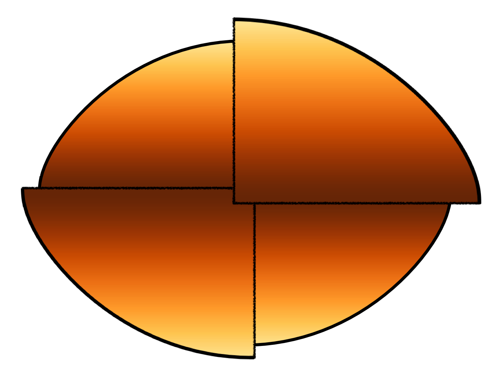

# Paint the Atmospheres of Rotating Stars (PARS)

This software quickly computes magnitudes and spectra of rotating stellar models. The models incorporate **Roche mass distribution** (where all mass is at the center of the star), **solid body rotation**, and **collinearity of effective gravity and energy flux**.

## Getting Started

The following instructions describe how to install PARS on macOS 10.15.4. These may have to be modified for other operating systems.

### Prerequisites

* git
* python

### Installation

Go to the directory where you want to install PARS, clone it in that directory, and go to the software's top directory.
```
cd <directory name>
git clone https://github.com/mlipatov/paint_atmospheres
cd paint_atmospheres
```

Install PARS.
```
pip install .
```

Place a file with limb darkening information from atmosphere models in the data directory.
```
cp ~/im01k2.pck ./data
```

Print the command line syntax for the executables.
```
calc_limbdark -h
calc_star -h
calc_spectra -h
```

## Deployment

The following instructions describe how to access the functionality of PARS in several different ways.

### Compute a Spectrum

Compute fits of intensity versus viewing angle from the limb darkening information.
```
calc_limbdark data/im01k2.pck data/limbdark_m01.pkl 0.1 0.4
```

Perform the inclination-independent computations for a stellar model.
```
calc_star 'data/limbdark_m01.pkl' 'data/vega.pkl' 0.6151 40.346 2.165 2.815 2.3694e19 100
```

Perform the inclination-dependent computations.
```
calc_spectra 'data/vega.pkl' 'data/vega/' -i 0.088418
```

Look at the resulting spectrum.
```
cat data/vega/*.txt | more
```

### Compute Magnitudes

Create files with filter transmission curves, such as [data/filters/Generic_Bessell.V.dat](data/filters/Generic_Bessell.V.dat)

Compute fits of *filtered* intensity versus surface inclination, then follow the same steps as above.
```
calc_limbdark data/im01k2.pck data/limbdark_m01f.pkl 0.1 0.4 -f data/filters/
calc_star 'data/limbdark_m01.pkl' 'data/vega.pkl' 0.6151 40.346 2.165 2.815 2.3694e19 100
calc_spectra 'data/vega.pkl' 'data/vega/' -i 0.088418
cat data/vega/*.txt | more
```

### Run Sample Scripts

Go to the directory with scripts, run a script, look at the result.
```
cd pa/usr/
python 09_colormag_inclinations.py
ls ../../vega_colormag.pdf
```

#### Scripts

These create figures 3 - 10 in [LB] (see References below).

* Intensity vs. viewing angle, goodness of fit checks: [1](pa/usr/03a_Imu_fits_min.py) followed by [2](03b_Imu_fits.py)
* [Temperature error](pa/usr/04_temperature.py)
* Error due to interpolation in [temperature](pa/usr/05a_temperature_interpolation.py) and [gravity](pa/usr/05b_gravity_interpolation.py)
* [Convergence of the longitudinal integral](pa/usr/06_convergence.py)
* [Error in the longitudinal integral](pa/usr/07_error_heat_map.py)
* [Comparison with an observed spectrum](pa/usr/08_vega_spectrum_comparison.py)
* [Color-magnitude diagram for a range of inclinations](pa/usr/09_colormag_inclinations.py)
* [Planetary transits](pa/usr/10_transit.py)

## Authors

* **Timothy D. Brandt**
* [Mikhail Lipatov](https://github.com/mlipatov/)

## References 
	
* Lipatov M & Brandt TD, Submitted to ApJ [LB]
* Espinosa Lara F & Rieutord M (2011), A&A, 533, A43
* Castelli F & Kurucz RL (2004), arXiv:astro-ph/0405087 
* [Wolfram World: Cubic Formula](http://mathworld.wolfram.com/CubicFormula.html)
* [Wikipedia: Bilinear interpolation: Algorithm](https://en.wikipedia.org/wiki/Bilinear_interpolation#Algorithm)
* [Wikipedia: Newton's Method](https://en.wikipedia.org/wiki/Newton%27s_method)
* Press WH et al, Numerical Recipes, 3rd ed. (2007) 
